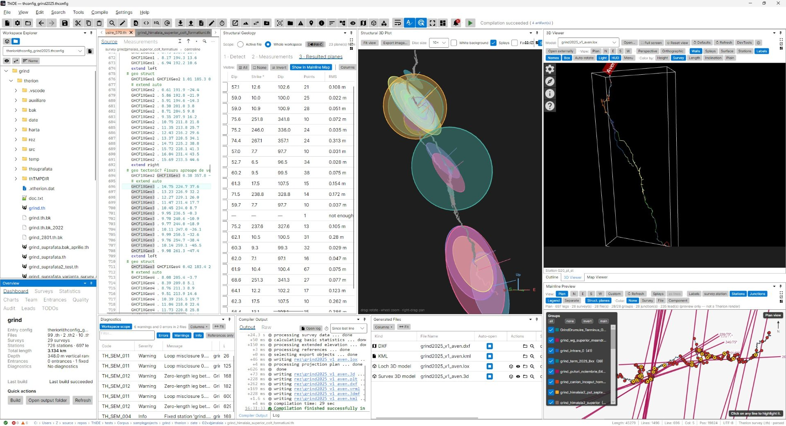
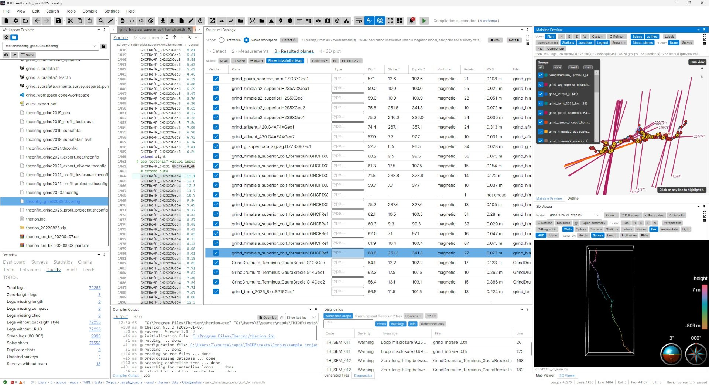
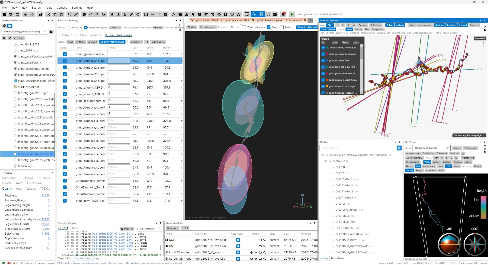

# Structural Geology (plane strike/dip calculator)

The Structural Geology module computes the orientation — **strike and dip** — of planar geological
features (bedding planes, faults, joints) from ordinary Therion cave-survey shots. It is the in-app
successor to the standalone *TherionStructuralCalculator*.

## The idea

To record the orientation of a rock plane underground, a surveyor stands at one station and shoots to
several points lying on that planar surface. Converting those shots to 3-D points and **fitting a plane**
through them recovers the plane's strike and dip — standard structural-geology measurements. This module
automates that from your `.th` data.

The plane fit is a **total-least-squares (PCA) fit**: it minimises orthogonal distance to the plane, so
it is correct for **any** orientation including vertical/steep planes (unlike a `z = a·x + b·y + c`
regression). More points only improve the result — the solver cost is independent of the count.

## Enabling it

It is **off by default**. Turn it on in **Preferences ▸ Build / Visualization ▸ “Structural Geology
module”**, then open it from **View ▸ Structural Geology**. The panel is a four-step wizard you can move
through freely; changing an earlier step updates everything downstream immediately.

### 1 · Detect

Choose the scope (active file or whole project) and how structural shots are recognised. A shot is
structural if it matches **any** enabled signal:

- **Station-name keyword** — the `from`-station name contains a keyword (default `geo`).
- **Comment marker** — the shot's comment contains a marker (e.g. `# plane fault-A`).
- **Station flag** — the `from`/`to` station carries a flag you name.

Other options:

- **Group a plane by** — *from-station* (consecutive shots from one station, the default),
  *comment parameter* (all shots tagged `# plane <name>` regardless of station), or *flag*.
- **Splay shots** — *exclude* (default), *include*, or *only splays*. Splays are always listed; this
  sets whether they start ticked.
- **Include the origin point** — adds the `from`-station itself to the fit. Use only when the station
  lies on the measured plane (watch the RMS column).
- **Magnetic declination** — *off* (magnetic north), *manual* (enter °, east positive), or *WMM auto*
  (computed from the project fix point + survey date using a bundled `WMM.COF`). Declination shifts
  **strike / dip-direction to true north; dip is unaffected**. Off by default so a survey's own
  `declination` is not double-counted.

### 2 · Measurements

Every detected measurement, with an **include checkbox**. Tick/untick points (and splays / the origin)
to control each plane's fit — the plane recomputes live. Double-click a row to jump to its source line.

### 3 · Resulted planes

One row per plane: **dip**, **strike**, dip-direction, north reference (magnetic or true), point count,
and **RMS** residual (fit quality — a large value flags an outlier or a non-planar batch). Double-click
to jump to source.

### 4 · 3-D plot

The included planes drawn as translucent oriented discs together with the cave main-line, so you can see
each plane in its true position. Drag to rotate, wheel to zoom, right-drag to pan; click a disc to select
its plane.

## Magnetic declination & WMM

*WMM auto* needs a public-domain NOAA **`WMM.COF`** model file placed in `%AppData%/ThIDE/` (or
next to the app). It also needs a `fix`ed station in a convertible coordinate system (UTM / lat-long) and
a survey `date`. When any of these is missing the panel falls back with a note; use *manual* declination
(the value the Declination calculator or Therion reports) instead.

## Command line

The same engine is available headlessly (no GUI required):

```
therion-cli structural <file.th> [--keyword geo] [--declination <deg>] [--format table|csv]
```

Example:

```
$ therion-cli structural cave.th
Plane                     Dip  Strike  DipDir  Pts      RMS
cave.geo1                34.2   118.0   208.0    6    0.018
2 plane(s).
```

## Reusing the engine

The logic lives in the dependency-free **`Therion.Structural`** library (detection, extraction, the
plane fit, and declination), consuming the shared `ShotSymbol` / `SemanticModel` object graph. It has no
UI or web dependency, so it can be embedded in other tools or automation. Entry point:
`StructuralAnalysis.Analyze(semanticModel, options)`.

## Screenshots
[](./screenshots/thide_geostruct_overview.jpeg)

[](./screenshots/thide_geostruct_1.jpeg)
[](./screenshots/thide_geostruct_2.jpeg)
[](./screenshots/thide_geostruct_3.jpeg)